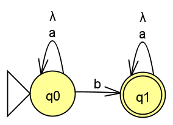

## Non Deterministic Finite Automata
### (Last updated: 16-10-2020)
The objective of the programm is to generate a NFA which allows to please the regular expression a*ba*
To my understanding, a*ba* means that there can be any number of a's and then a b, followed by any number of a's afterwards.
Using JFlap i came to the conclusion that it could be achieved using the following NFA:

 
  <li>I made this based on the last program i made, which was used to generate a DFA.</li>
  <li>The main differences are: 
	<ul> 	<li>In the caracter subroutine the returning values change a little bit</li>
		<li> the table used to determine whether or not a state is valid is a lot simplier now</li>
		<li> some conditions are added and some removed</li>
		<li> instead of using an alphabet consisting of numbers and operators, i use an alphabet consisting of a's and b's</li>
	</ul>
  </li>  
  

#### issues while writing:

First of all, some of my classmates where asking me questions about how i was doing stuff, and they seemed to be using an entirely different approach to this problem, so, i'm not entirely sure my logic while doing this was the right one.
Appart from that, the biggest issue i had while writting this code was determining how to distribute the values in the table for it to make sense 
since my automata only has 2 states, this didn't take long to solve.
the distribution i used was this one:

| 0 | 1  | 2 |

| 1 | 2  | 2 |

The logic behind that is that while the characters are a caracter will return a 0 which indicates the first row of values,
and the only way to invalidate the string from the beggining is to use an invalid character, that isn't a nor b, which makes caracter return a 2, with the state being 0 during the first part of the execution, it's 0 for an a, 1 for a b (which advances to the next state) and 2 for any invalid character.
Since 1 advances to the next state, in state 1 only a's are permited, because in order to leave state 0 a b was needed. This way we can use any number of a's, followed by a b, followed by any other number of a's.

## Information

Universidad Politécnica de San Luis Potosí
Written by: Rodrigo Alejandro Ortiz Muñiz - 181086
Professor: Juan Carlos Gonzáles Ibarra
Assignature: Teoría computacional.

## License
[MIT](https://choosealicense.com/licenses/mit/)
